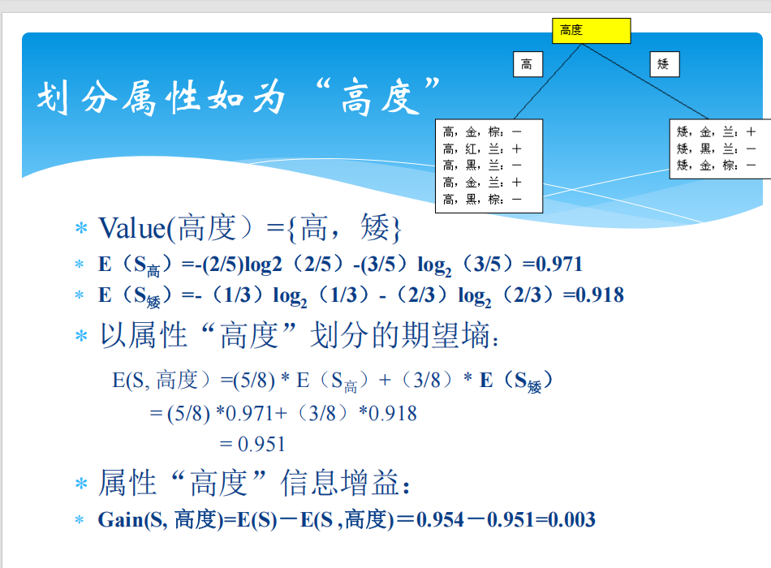

#### 人工智能基本概念
定义：
    自然智能：指人类和动物具有的智力，涉及感知、记忆、思维、学习和行为能力。
    人工智能 (AI)：通过人工方法使机器具备类似于人的智能（能听、能写、能看、能思考推理、会学习）。
智能的层次：
    高层：大脑皮层（记忆、思维）。
    中层：丘脑（感知）。
    低层：小脑、脊髓（动作反应）。
#### 三大技术流派
符号主义 (Symbolism)：逻辑主义，起源于数理逻辑，认为智能的核心是符号操作和逻辑推理。
连接主义 (Connectionism)：仿生学派，起源于人脑模型，核心是神经网络和学习算法。
行为主义 (Actionism)：进化主义，起源于控制论，强调“感知-动作”模式（如六足机器虫）。
趋势：当前趋向于三者取长补短、综合集成。
#### 课程核心内容与方法
数学基础、线性模型、支持向量机 (SVM)、朴素贝叶斯。
神经网络与深度学习（当前权重最大）。
知识表示、推理技术、搜索技术、强化学习。
#### 常用搜索算法
穷举法、启发式搜索。
广度优先搜索 (BFS)、深度优先搜索 (DFS)。    
经典问题示例：
    重排九宫 (8-puzzle)：练习状态空间表示和搜索路径。
    旅行商问题 (TSP)：动态规划。
    梵塔问题 (Tower of Hanoi)：问题分解。
    博弈问题：如五子棋。

# 2-1[[决策树]]的学习（ID3）
ID3算法主要针对分类属性的选择，通过==信息增益度==进行属性的选择，以此构造最小决策树。
#### 信息量
$$I(a_i) = \log_2 \frac{1}{p(a_i)} = -\log_2 p(a_i)$$
其中p表示事件ai发生的概率，因此，事件发生的概率越小，则信息量越大。
#### 信息熵/期望熵
$$H(X) = \sum_{i=1}^{n} p(a_i) \log_2 \frac{1}{p(a_i)}$$
信息熵就是“平均信息量”，衡量了一个系统的“不确定性”。各个互不相容事件的信息熵，有且仅有一个发生。其中$p(a_i) \log_2 \frac{1}{p(a_i)}$表示该事件对整体熵的贡献。
1. H(x)>=0 当系统是确定的时候取等号
2. 当所有事件等概率发生的时候（最混乱），H(x)取最大值
#### 条件熵
$$H(X|Y) = -\sum_{x,y} p(x,y) \log p(x|y)$$
已知Y属性时，关于X的信息度量。
#### 互信息/信息增益
$$I(X;Y) = H(X) - H(X|Y)$$
通过差值计算Y条件带来的信息增益，以此来决定更好的节点，因为这样可以最有效的解决系统的不稳定性。

（
*KL 散度 ：衡量两个概率分布之间的“距离”或差异。在深度学习中常用来衡量预测分布与真实分布的差距。
交叉熵 ：分类任务中最常用的损失函数，本质上是衡量模型预测出来的概率分布与实际分布的接近程度。
）*

