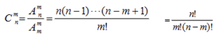
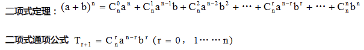

#### 分类加法计数原理 
做一件事情完成它有N类办法在第一类办法中有M1种不同的方法在第二类办法中有M2种不同的方法.....在第N类办法中有My种不同的方法，那么完成这件事情共有M1+M2......+MN种不同的方法。

#### 分步乘法计数原理
做一件事，完成它需要分成N个步骤，做第一步有m1种不同的方法，做第二步有M2不同的方法，.....做第N步有MN不同的方法.那么完成这件事共有N=M1M2...MN种不同的方法。

### 排列（代号 A，全称 Arrangement）

- **核心特征**：顺序很重要！
- **例子**：班里10个同学，选出3个人分别当**班长、学委、体委**。
    - 小明当班长、小红当学委 —— 和 —— 小红当班长、小明当学委，这绝对不一样！顺序变了，结果就变了。

- **公式怎么理解**：
$$A_{10}^{3}$$（从10个里挑3个排列）
想象有3把椅子。  
第1把椅子（班长）：有10个人可以坐（10种选择）。  
第2把椅子（学委）：前面坐了1个，还剩9人（9种选择）。  
第3把椅子（体委）：还剩8人（8种选择）。  
总数 = 10 × 9 × 8。

## 组合（代号 C，全称 Combination）

- **核心特征**：顺序不重要！
- **例子**：班里10个同学，选出3个人**去扫地**。
    - 选出小明、小红、小刚 —— 和 —— 选出小红、小刚、小明。这有没有区别。
    
- **公式怎么理解**：
$$C_{10}^{3}$$
顺序不重要，所以我们在刚才排列 $A_{10}^{3}$的基础上，把“因为顺序不同而多算进去的次数”给**除掉**。  
3个人自己内部排队有几种排法？
是 $A_{3}^{3}$=3×2×1=6A33​=3×2×1=6种。
所以，组合数就是排列数除以多余的排法：$C_{10}^{3}$=$A_{10}^{3}$/$A_{3}^{3}$=10×9×8/3×2×1

- **组合数的两个性质：

$$C_{n}^{m}=C_{n}^{n-m}$$
从10个人里选3个去扫地，就等于选出7个人不去扫地。($C_{10}^{3}=C_{10}^{7}$)
$$C_{n+1}^{m}=C_{n}^{m}+C_{n}^{m-1}$$这个叫杨辉三角公式。不用死记，随着做题慢慢会眼熟。

## 二项式定理

