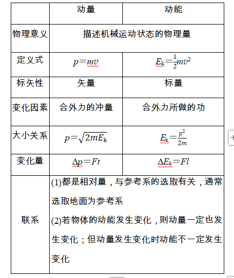
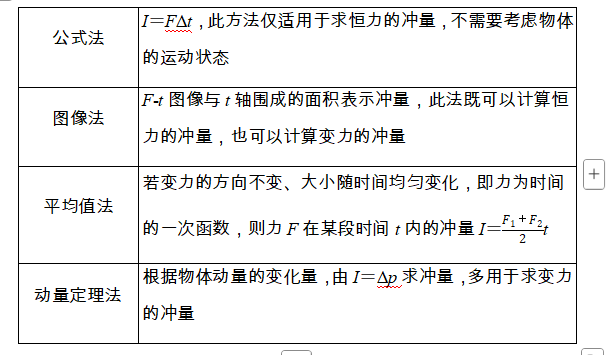

### 学习目标
1.理解动量和冲量，理解动量定理及其表达式，能用动量定理解释生活中的有关现象。
2.能利用动量定理解决相关问题，会在流体力学中建立“柱状”模型。

## 必备知识

#### 1.动量
(1)定义：物体的质量和速度的乘积。
(2)表达式：p＝mv，单位为kg·m/s。
(3)方向：动量是矢量，其方向与速度的方向相同。
#### 2.动量变化量
(1)动量的变化量Δp等于末动量p'减去初动量p的矢量运算，也称为动量的增量，即Δp＝p'-p。
(2)动量的变化量Δp也是矢量，其方向与速度的改变量Δv的方向相同，运用矢量法则计算。
#### 3.冲量
(1)定义：力与力的作用时间的乘积。
(2)公式：I＝FΔt。
(3)单位：N·s。
(4)方向：冲量是矢量，其方向与力的方向相同。

## 动量与动能的关系

## 冲量的计算方法

## 动量定理的理解及应用

1.内容：物体在一个过程中所受力的冲量等于它在这个过程始末的动量变化量。

2.公式：_F_(_t'_-_t_)＝mv'-mv或I＝p'-p。

3.对动量定理的理解：

(1)公式中的F是研究对象所受的所有外力的合力。它可以是恒力，也可以是变力。当合外力为变力时，_F_是合外力作用时间的平均值。

(2)_Ft_＝_p'_-_p_是矢量式，两边不仅大小相等，而且方向相同。

(3)动量定理中的冲量可以是合外力的冲量，可以是各个力冲量的矢量和，也可以是外力在不同阶段冲量的矢量和。

(4)_Ft_＝_p'_-_p_还说明了两边的因果关系，即合外力的冲量是动量变化的原因。

(5)由_Ft_＝_p'_-_p_得_F_＝，即物体所受的合外力等于物体动量的变化率。

(6)当物体运动包含多个不同过程时，可分段应用动量定理求解，也可以全过程应用动量定理求解。