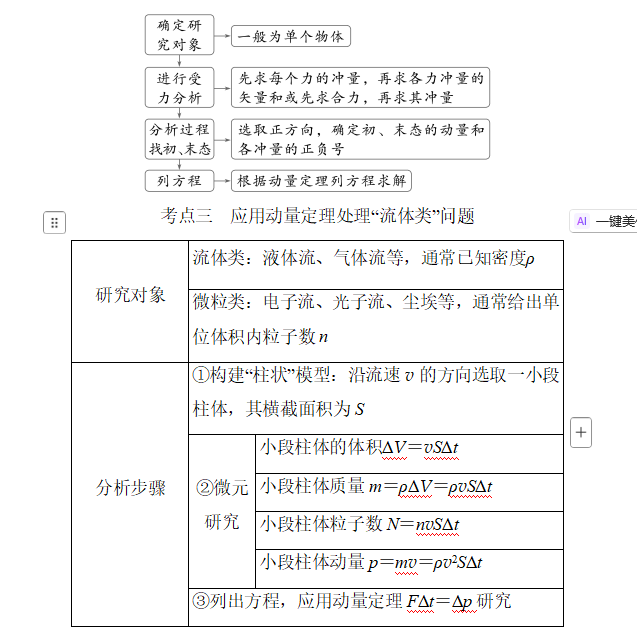

### 学习目标
1.理解系统动量守恒的条件并会应用动量守恒定律解决基本问题。
2.能熟练运用动量守恒定律解决临界问题。
3.会用动量守恒观点分析爆炸问题、反冲运动和人船模型。

## 考点一　系统动量守恒的判断

1.内容
如果一个系统不受外力，或者所受外力的==矢量和为0==，这个系统的总动量保持不变。

2.适用条件
(1)理想守恒：不受外力或所受外力的合力为零。
(2)近似守恒：系统内各物体间相互作用的内力远大于它所受到的外力，如碰撞、爆炸等过程。
(3)某一方向守恒：如果系统动量不守恒，但在某一方向上不受外力或所受外力的合力为零，则系统在这一方向上动量守恒。

## 考点二　动量守恒定律的基本应用
1.动量守恒定律的表达式
(1)p＝p'或m1v1＋m2v2＝m_1_v_1_'_＋_m_2_v_2_'_。即系统相互作用前的总动量等于相互作用后的总动量。
(2)Δ_p_1＝-Δ_p_2，相互作用的两个物体动量的变化量等大反向。

## 冲量的计算方法

## 动量定理的理解及应用

1.内容：物体在一个过程中所受力的冲量等于它在这个过程始末的动量变化量。

2.公式：_F_(_t'_-_t_)＝mv'-mv或I＝p'-p。

3.对动量定理的理解：

(1)公式中的F是研究对象所受的所有外力的合力。它可以是恒力，也可以是变力。当合外力为变力时，F是合外力作用时间的平均值。

(2)Ft＝p'-p是矢量式，两边不仅大小相等，而且方向相同。

(3)动量定理中的冲量可以是合外力的冲量，可以是各个力冲量的矢量和，也可以是外力在不同阶段冲量的矢量和。

(4)Ft＝p'-p还说明了两边的因果关系，即合外力的冲量是动量变化的原因。

(5)由Ft＝p'-p得F＝Δp/t，即物体所受的合外力等于物体动量的变化率。

(6)当物体运动包含多个不同过程时，可分段应用动量定理求解，也可以全过程应用动量定理求解。

## 动量定理解题思路

