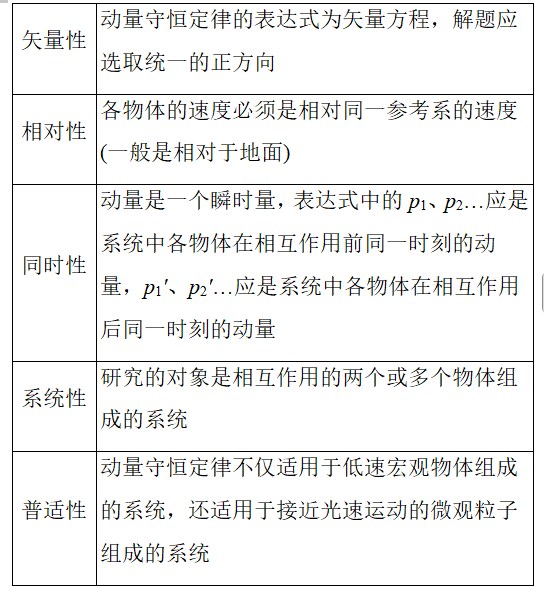
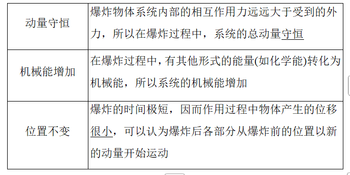
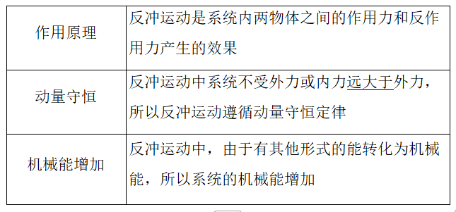
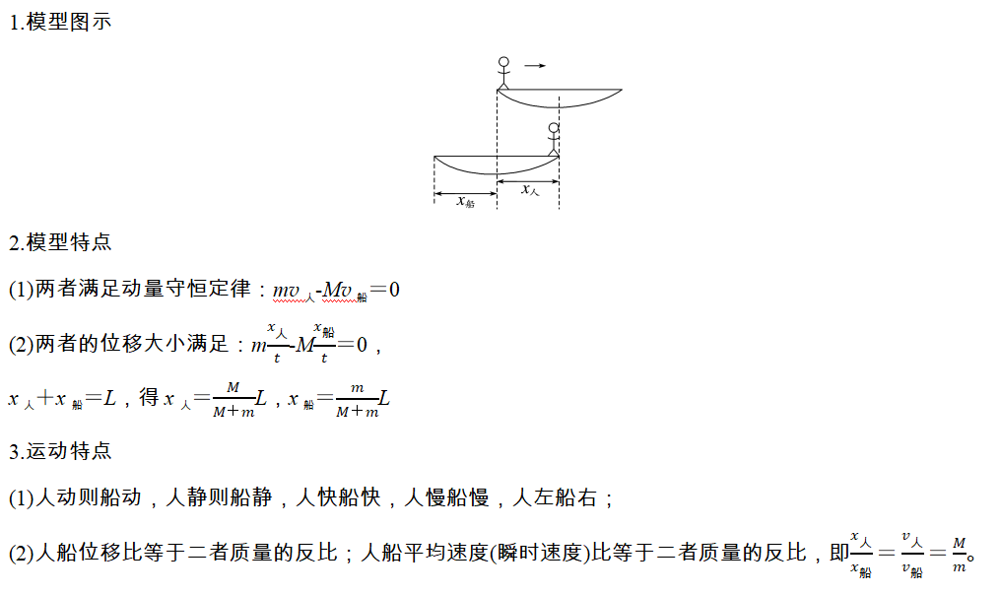

### 学习目标
1.理解系统动量守恒的条件并会应用动量守恒定律解决基本问题。
2.能熟练运用动量守恒定律解决临界问题。
3.会用动量守恒观点分析爆炸问题、反冲运动和人船模型。

## 考点一　系统动量守恒的判断

1.内容
如果一个系统不受外力，或者所受外力的==矢量和为0==，这个系统的总动量保持不变。

2.适用条件
(1)理想守恒：不受外力或所受外力的合力为零。
(2)近似守恒：系统内各物体间相互作用的内力远大于它所受到的外力，如碰撞、爆炸等过程。
(3)某一方向守恒：如果系统动量不守恒，但在某一方向上不受外力或所受外力的合力为零，则系统在这一方向上动量守恒。

## 考点二　动量守恒定律的基本应用
1.动量守恒定律的表达式
(1)p＝p'或m1v1＋m2v2＝m1v1'＋m2v2'。即系统相互作用前的总动量等于相互作用后的总动量。
(2)Δp1＝-Δp2，相互作用的两个物体动量的变化量等大反向。
#### 动量守恒定律的五个特性

## 考点三　爆炸问题、反冲运动、人船模型

#### 爆炸问题

#### 反冲运动

#### 人船模型

