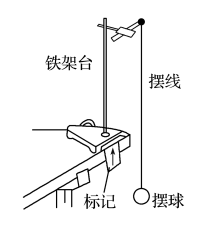
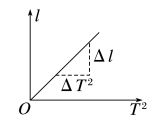

### 学习目标
1.知道利用单摆测量重力加速度的原理，掌握利用单摆测量重力加速度的方法。
2.会对测量数据进行处理并进行误差分析。

## 实验技能储备

#### 实验原理
当摆角较小时，单摆做简谐运动，其运动周期为$T = 2\pi \sqrt{\frac{l}{g}}$，由此得到$g = \frac{4\pi^2 l}{T^2}$，因此，只要测出摆长l和振动周期T，就可以求出当地的重力加速度g的值。

#### 实验器材
铁架台、单摆、游标卡尺、毫米刻度尺、停表。

#### 实验过程

(1)让细线的一端穿过金属小球的小孔，做成单摆。
(2)把细线的上端用铁夹固定在铁架台上，把铁架台放在实验桌边，使铁夹伸到桌面以外，让摆球自然下垂，在单摆平衡位置处做上标记，如图所示。
(3)用毫米刻度尺量出摆线长度l’，用游标卡尺测出金属小球的直径，即得出金属小球半径r，计算出摆长l＝l'＋r。
(4)把单摆从平衡位置处拉开一个很小的角度(小于5°)，然后放开金属小球，让金属小球摆动，待摆动平稳后测出单摆完成30~50次全振动所用的时间t，计算出单摆的振动周期T。
(5)根据单摆周期公式，计算当地的重力加速度。
(6)改变摆长，重做几次实验。

#### 数据处理

(1)公式法：利用$T = \frac{t}{N}$求出周期，算出三次测得的周期的平均值，然后利用公式$g = \frac{4\pi^2 l}{T^2}$求重力加速度。
(2)图像法：

根据测出的一系列摆长l对应的周期T，作l－$T^2$$的图像，由单摆周期公式得$$l = \frac{g}{4\pi^2} T^2$，图像应是一条过原点的直线，如图所示，求出图线的斜率k，即可利用$g = 4\pi^2 k$求重力加速度。

#### 误差分析

系统误差：本实验的系统误差主要来源于单摆模型本身是否符合要求，即：悬点是否固定，球、线是否符合要求，摆动是圆锥摆还是在同一竖直平面内的摆动以及测量哪段长度作为摆长等等。

偶然误差：本实验的偶然误差主要来自时间(即单摆周期)的测量上。为了减小偶然误差，应进行多次测量后取平均值。

#### 减小误差的方法

(1)一般选用一米左右的细线。

(2)悬线顶端不能晃动，需用夹子夹住，保证悬点固定。

(3)应在小球自然下垂时用毫米刻度尺测量悬线长。

(4)单摆必须在同一平面内摆动，且摆角小于5°。

(5)选择在摆球摆到平衡位置处时开始计时，并数准全振动的次数。