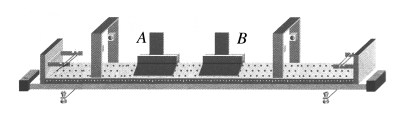
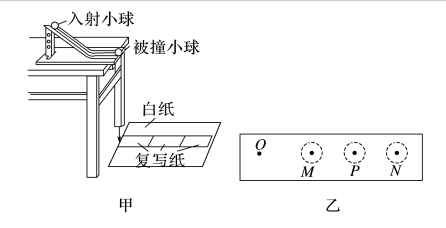

### 学习目标
1.理解动量守恒定律成立的条件，会利用不同方案验证动量守恒定律。
2.知道在不同实验方案中要测量的物理量，会进行数据处理及误差分析。

## 实验技能储备

#### 实验原理
在一维碰撞中，测出相碰的两物体的质量m1、m2和碰撞前、后物体的速度v1、v2、v1'、v2'，算出碰撞前的动量p＝m1v1＋m2v2及碰撞后的动量p'＝m1v1'＋m2v2'，比较碰撞前、后动量是否相等。

### 方案一：研究气垫导轨上滑块碰撞时的动量守恒
#### 实验器材
气垫导轨、数字计时器、天平、滑块(两个)、弹簧、细绳、弹性碰撞架、胶布、撞针、橡皮泥等。

#### 实验过程

(1)测质量：用天平测出滑块的质量。
(2)安装：正确安装好气垫导轨，如图所示。 
(3)实验：接通电源，利用配套的光电计时装置测出两滑块各种情况下碰撞前、后的速度。
(4)改变条件，重复实验：
①改变滑块的质量；
②改变滑块的初速度大小和方向。
(5)验证：一维碰撞中的动量守恒。

#### 数据处理
(1)滑块速度的测量：v＝Δx/Δt，式中Δx为滑块上挡光片的宽度(仪器说明书上给出，也可直接测量)，Δt为数字计时器显示的滑块(挡光片)经过光电门的时间。

(2)验证的表达式：m1v1＋m2v2＝m1v1'＋m2v2'。

### 方案二：研究斜槽末端小球碰撞时的动量守恒

#### 实验器材
斜槽、小球(两个)、天平、复写纸、白纸、圆规、铅垂线等。

#### 实验过程

(1)测质量：用天平测出两小球的质量，并选定质量大的小球为入射小球。
(2)安装：按照如图甲所示安装实验装置。调整固定斜槽使斜槽末端水平。
(3)铺纸：白纸在下，复写纸在上，且在适当位置铺放好。记下铅垂线所指的位置O。
(4)放球找点：不放被撞小球，每次让入射小球从斜槽上某固定高度处自由滚下，重复10次。用圆规画尽量小的圆把小球的所有落点圈在里面。圆心P就是小球落点的平均位置。
(5)碰撞找点：把被撞小球放在斜槽末端，每次让入射小球从斜槽同一高度(同步骤(4)中的高度)自由滚下，使它们发生碰撞，重复实验10次。用步骤(4)的方法，标出碰后入射小球落点的平均位置M和被撞小球落点的平均位置N，如图所示。
(6)验证：连接ON，测量线段OP、OM、ON的长度。将测量数据填入表中，最后代入m1·OP＝m1·OM＋m2·ON，计算并判断在误差允许的范围内等式是否成立。
(7)整理：将实验器材放回原处。

#### 数据处理
验证的表达式：m1·OP＝m1·OM＋m2·ON。

### 注意事项
1.前提条件：碰撞的两物体应保证“水平”和“正碰”。

2.方案提醒

(1)若利用气垫导轨进行验证，调整气垫导轨时，应确保导轨水平。

(2)若利用平抛运动规律进行验证：
①斜槽末端的切线必须水平；
②入射小球每次都必须从斜槽同一高度由静止释放；
③选质量较大的小球作为入射小球；
④实验过程中实验桌、斜槽、记录的白纸的位置要始终保持不变。