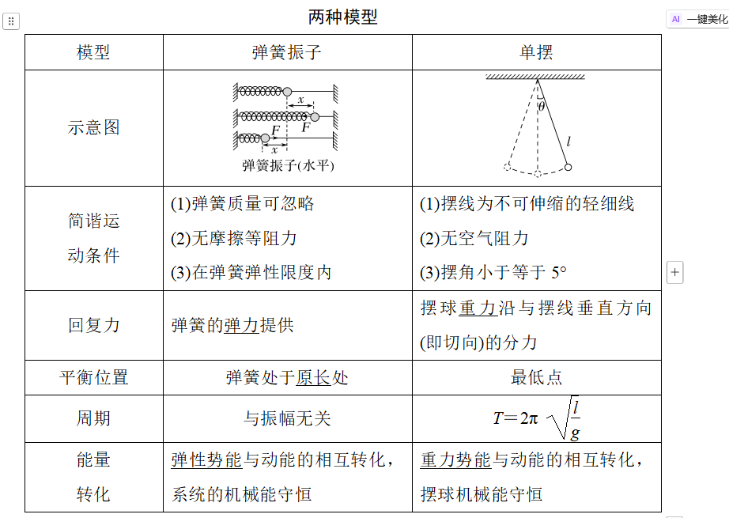
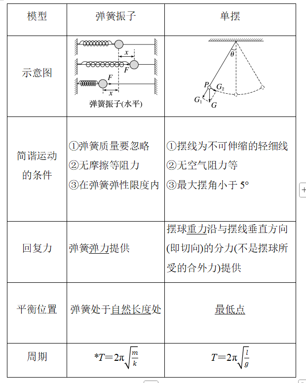
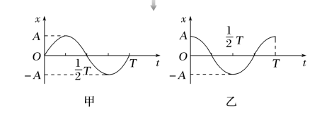
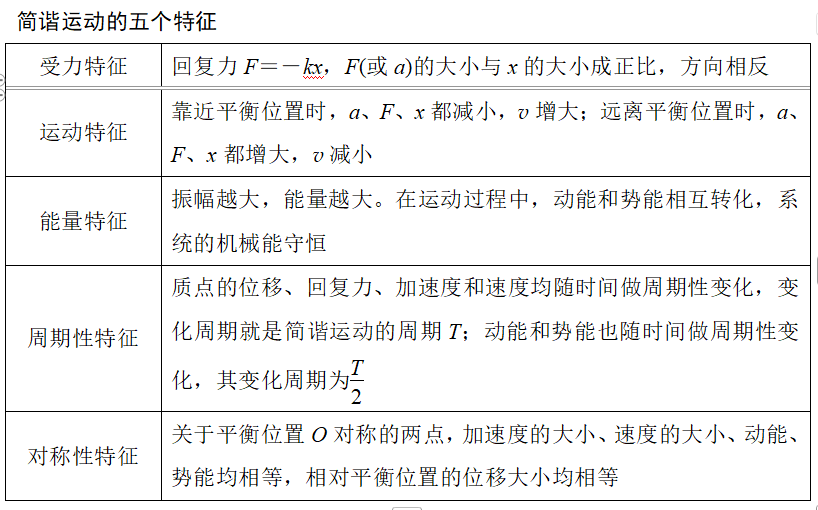
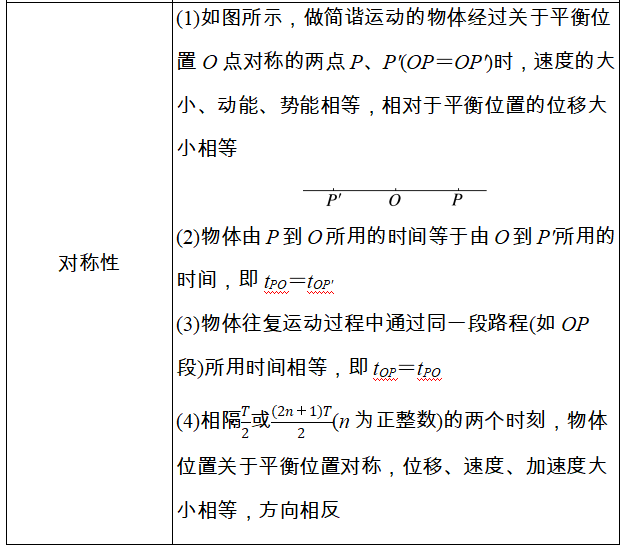

### 学习目标
1.知道简谐运动的概念，掌握简谐运动的特征，理解简谐运动的表达式和图像。
2.知道什么是单摆，熟记单摆的周期公式。
3.理解受迫振动和共振的概念，了解产生共振的条件。

## 必备知识

### 一 简谐运动

1.简谐运动：如果物体在运动方向上所受的力与它偏离平衡位置位移的大小成==正比==，并且总是==指向==平衡位置，这样的运动就是简谐运动。

2.平衡位置：物体在振动过程中==回复力==为零的位置。

3.回复力
(1)定义：使物体在平衡位置附近做==往复运动==的力。
(2)方向：总是指向平衡位置。
(3)性质：属于==效果力==。
(4)来源：可以是==某一个力==，也可以是==合力==或某个力的==分力==。

### 二、简谐运动的表达式和图像
#### 表达式
动力学表达式：F=−kx
运动学表达式：x=Asin(ωt+φ)

#### 图像

甲：从平衡位置开始计时（x=Asinωt）
乙：从最大位移开始计时（x=Acosωt）

### 三、受迫振动和共振

#### 受迫振动
(1)概念：系统在==驱动力==作用下的振动。
(2)振动特征：物体做受迫振动达到==稳定==后，物体振动的频率等于==驱动力的频率==，与物体的==固有频率==无关。

#### 共振
(1)概念：当驱动力的频率==等于==物体的固有频率时，物体做受迫振动的==振幅达到最大==的现象。
(2)共振的条件：驱动力的频率等于物体的固有频率。
(3)共振的特征：共振时振幅最大。
(4)共振曲线(如图所示)。
 
f＝f0时，A＝Am，f与f0相差越大，物体做受迫振动的振幅越小。

## 考点一  简谐运动的基本特征

